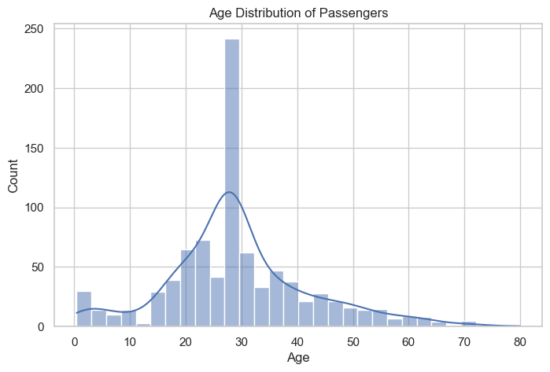
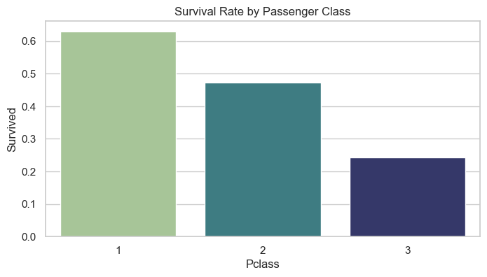
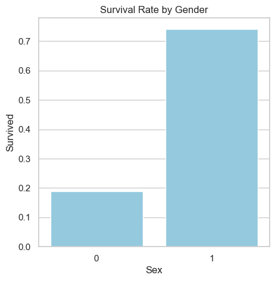
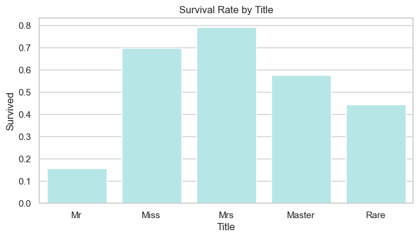
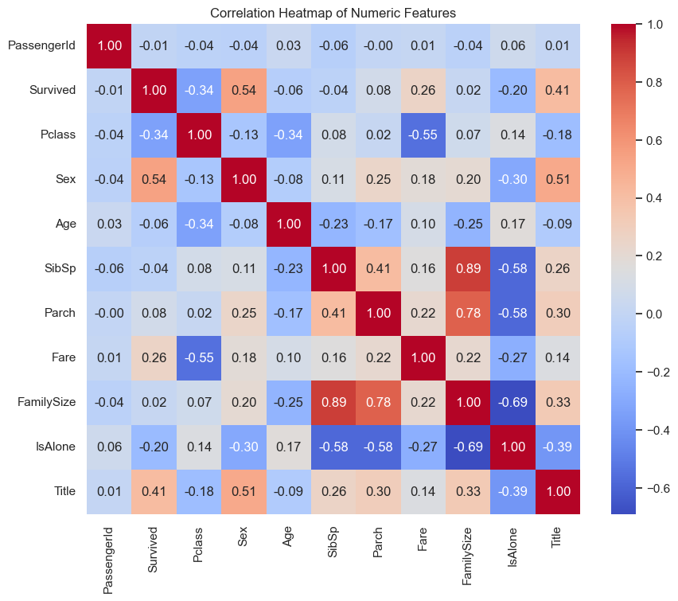

## Titanic Survival Analysis

### Project Overview
This project analyzes the survival of passengers on the Titanic using machine learning techniques. The analysis leverages Python's data science libraries to preprocess data, perform exploratory data analysis (EDA), build predictive models, and evaluate their accuracy and performance. We use the popular Titanic dataset from Kaggle.

### Data Preprocessing

#### Handling Missing Values
- **Age**: A significant number of entries were missing the `Age` data. Since age can be an important factor in survival, instead of discarding these entries, missing values were imputed using the median age of the dataset. Using the median is a common practice as it is less sensitive to outliers than the mean and helps maintain the distribution of age.
- **Embarked**: Only a few entries were missing the `Embarked` data, which represents the port of embarkation. Missing values were filled with the mode (the most common embarkation point), ensuring that the data remains consistent with the majority trend and avoids introducing bias that could occur if this feature was left blank or filled arbitrarily.

#### Encoding Categorical Variables
Categorical variables like `Sex` and `Embarked` were encoded to transform them from string labels into numerical format, which is necessary for most machine learning models that require numerical input:
- **Sex**: Converted into binary format (`1` for female and `0` for male). This binary encoding directly maps the two categories to numbers, making it straightforward for the model to utilize this information.
- **Embarked**: This feature, indicating the port of embarkation, was transformed using one-hot encoding, which creates new columns for each category (`Embarked_C`, `Embarked_Q`, `Embarked_S`). This method is beneficial for nominal categorical data without intrinsic ordering, allowing models to treat each category's impact independently.

#### Dropping the Cabin Column
- **Cabin**: The `Cabin` column had a large number of missing values (over 70% missing). The column was dropped to simplify the model and focus on more informative, reliably available features.

#### Feature Engineering
New features such as `FamilySize` and `IsAlone` were derived from existing data (`SibSp` + `Parch`) to provide the models with structured information that might capture survival factors better than raw data alone. `FamilySize` combines siblings, spouses, parents, and children into a single count, reflecting the size of each passenger's family aboard. `IsAlone` was created to distinguish passengers traveling alone, as solo travelers might have had different survival prospects compared to those with family.

### Exploratory Data Analysis (EDA)

**Age Distribution:**

The majority of passengers are in their 20s to 30s, highlighting a younger demographic on board, with the distribution skewing slightly towards younger adults.

**Survival Rate by Passenger Class:**

Passengers in the first class had the highest survival rate, suggesting socioeconomic status was a significant factor in survival chances.

**Survival Rate by Gender:**

Female passengers had a much higher survival rate compared to males, supporting historical accounts that women were given priority in lifeboat boarding.

**Survival Rate by Title:**

Titles indicate social status and gender roles, with 'Mrs' and 'Miss' showing higher survival rates, likely attributed to the priority given to women. 'Master' also demonstrated a higher survival rate than 'Mr', reinforcing the notion that socioeconomic status was a significant factor in survival outcomes.

**Correlation Heatmap:**

Significant positive correlations are observed between `Fare` and survival, indicating that those who paid higher fares, typically in higher classes, had better survival odds.

### Model Building and Evaluation

A Random Forest classifier was chosen for its effectiveness in handling both linear and non-linear data, and its ability to deal with imbalanced datasets. The data was split into training, validation, and testing sets to evaluate the model's performance effectively.

**Hyperparameter Tuning:**

To enhance the Random Forest model's performance on the Titanic dataset, hyperparameter tuning was implemented using GridSearchCV. This method tested various combinations of `n_estimators` (number of trees) and `max_depth` (maximum depth of each tree) to identify the optimal settings that maximize model accuracy.

**Model Evaluation Results**

- **Validation Accuracy**: Initially at 82.58%, improved to 82.58% after tuning.
- **Test Accuracy**: Achieved a high of 85.47%.

**Detailed Performance Metrics:**

| Metric | Class 0 | Class 1 |
|---|---|---|
| Test Accuracy | 0.8547 | - |  | Precision | 0.88 | 0.82 |
| Recall | 0.88 | 0.82 |
| F1-Score | 0.88 | 0.82 |

### Conclusion
The analysis provides valuable insights into the factors affecting the survival of Titanic passengers and demonstrates the effectiveness of Random Forest in predicting outcomes. Future work could explore more sophisticated models or feature engineering techniques to further enhance prediction accuracy.